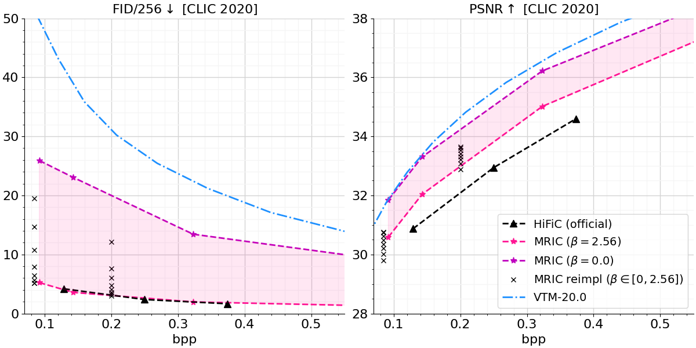

# Multi-Realism Image Compression (MRIC)

[](https://colab.research.google.com/drive/19QTm_j_0coBg76ZDeNyzFwY-LsNYfMld?usp=sharing)

This repository provides a TensorFlow 2 implementation of MRIC based on:

- [Multi-Realism Image Compression with a Conditional Generator (CVPR 2023)](https://arxiv.org/abs/2212.13824).

> **Abstract** <br>
> By optimizing the rate-distortion-realism trade-off, generative compression approaches produce detailed, realistic images, even at low bit rates, instead of the blurry reconstructions produced by rate-distortion optimized models. However, previous methods do not explicitly control
how much detail is synthesized, which results in a common
criticism of these methods: users might be worried that a
misleading reconstruction far from the input image is generated. In this work, we alleviate these concerns by training a decoder that can bridge the two regimes and navigate
the distortion-realism trade-off. From a single compressed
representation, the receiver can decide to either reconstruct
a low mean squared error reconstruction that is close to
the input, a realistic reconstruction with high perceptual
quality, or anything in between. With our method, we set a
new state-of-the-art in distortion-realism, pushing the frontier of achievable distortion-realism pairs, i.e., our method
achieves better distortions at high realism and better realism at low distortion than ever before.

## Updates

***01/11/2024***

1. Initial release of this project

## Visual Example

The image below (left) is taken from the [CLIC 2020 test set](https://www.tensorflow.org/datasets/catalog/clic), external to the training set. The right image is its corresponding reconstruction, when using MRIC ($\beta=2.56$) with  $\lambda=0.128$ (lowest quality setting).

<div align="center">
  
  
</div>

```python
CLIC 2020: ad24 | Bits per pixel: 0.1501 (59kB)
```

More example reconstructions can be found [here](https://github.com/Nikolai10/MRIC/blob/master/res/doc/subpages/visualizations.md).

## Quantitative Performance

We trained two models using $`\lambda \in \{0.128, 0.032\}`$ for 2.3M steps as described [here](https://github.com/Nikolai10/MRIC?tab=readme-ov-file#quality-assertions-deviations).

In this section we quantitatively compare the performance of MRIC (reimpl) to the officially reported numbers. 
We add [VTM-20.0](https://vcgit.hhi.fraunhofer.de/jvet/VVCSoftware_VTM/-/releases/VTM-20.0) (state-of-the-art for non-learned codecs) and [HiFiC](https://github.com/tensorflow/compression/tree/master/models/hific) (long-standing previous state-of-the art for generative image compression) for the sake of completeness. The FID/256-computation is based on Torch-Fidelity, similar to [MS-ILLM](https://github.com/facebookresearch/NeuralCompression/blob/main/projects/illm/eval_folder_example.py), as common in the literature.

We generally find that MRIC (reimpl) tends to favor low FID scores over high PSNR values. 
For MRIC ($\beta=2.56$) we obtain competitive results in terms of statistical fidelity, while having slightly higher distortion. For MRIC ($\beta=0.0$), we obtain some different operating point along the rate-distortion-perception plane that resembles more the traditional compression setting (high PSNR). 
For MRIC ($0 < \beta < 2.56$) we obtain any operating mode in between, providing great flexibility to user/ application-based preferences. 

We leave the exploration for better trade-offs to future work.

<p align="center">
    
</p>

For MRIC reimpl we use $`\beta \in \{2.56, 1.28, 0.64, 0.32, 0.16, 0.08, 0.04, 0.0\}`$.

## Install

```bash
$ git clone https://github.com/Nikolai10/MRIC.git 
```

This project has been developed using [docker](https://www.docker.com/); we recommend using the [tensorflow:2.14.0-gpu-jupyter](https://hub.docker.com/layers/tensorflow/tensorflow/2.14.0-gpu-jupyter/images/sha256-981372796921ef7bb75f4fe5fbe98c335824d08233bed57586633199028d5e18?context=explore) docker image, which uses tfc==2.14.0 by default (latest).

A tensorflow/ docker installation guideline is provided [here](https://www.tensorflow.org/install/docker).

## Training/ Inference
Please have a look at the [example Colab notebook](https://colab.research.google.com/drive/19QTm_j_0coBg76ZDeNyzFwY-LsNYfMld?usp=sharing) for more information.

## Quality Assertions/ Deviations

The general goal of this project is to provide an exact reimplementation of [MRIC](https://arxiv.org/abs/2212.13824). In this section we highlight some minor technical deviations from the official work that we have made to achieve a better trade-off between stability and performance for our particular setup.

|                       | Official                              | Reimplementation                                  |
|-----------------------|---------------------------------------|---------------------------------------------------|
| Data                  | proprietary dataset                   | [Open Images](https://www.tensorflow.org/datasets/catalog/open_images_v4)     |
| optimization strategy | end-to-end from scratch               | multi-stage training (similar to [HiFiC, Sec. A6](https://arxiv.org/pdf/2006.09965.pdf))           |
| optimization steps    | 3M                                    | 2.3M = 2M (stage 1) + 0.3M (stage 2)              |
| higher $\lambda$      | $10\times$ in the first 15% steps     | -                                                 |
| learning rate decay   | 1e-4 -> 1e-5 for the last 15% steps   | 1e-4 -> 1e-5 for the last 15% steps of stage 1; we use a constant learning rate for stage 2 (1e-4) |
| entropy model         | small variant of [ChARM](https://arxiv.org/abs/2007.08739) (10 slices)     | [TBTC-inspired](https://openreview.net/pdf?id=IDwN6xjHnK8) variant of ChARM (see Figure 12)   |

Note that the entropy model probably plays a minor role in the overall optimization procedure; at the time of development, we simply did not have access to the official ChARM configuration.

If you find better hyper-parameters, please share them with the community.

## Pre-trained Models
All pre-trained models ($\lambda=0.128, 0.032$) can be downloaded [here](https://drive.google.com/drive/folders/1COi413Z6D8VLmQ_5I4q39BqBhbOimP3q?usp=sharing).

## Directions for Improvement

- add sophisticated data pre-processing methods (e.g. random resized cropping, random horizontal flipping), see [_get_dataset (HiFiC)](https://github.com/tensorflow/compression/blob/master/models/hific/model.py#L283) for some inspiration.
- explore different hyper-parameters; can we obtain a single model that obtains both state-of-the-art results for distortion (MRIC $\beta=0.0$) **and** perception (MRIC $\beta=2.56$)?

## File Structure

Note that we have taken great care to follow the official works - e.g. if you are already familiar with [HiFiC](https://github.com/tensorflow/compression/tree/master/models/hific), you will find that [hific_tf2](https://github.com/Nikolai10/MRIC/tree/master/src/hific_tf2) follows the exact same structure (similar applies to [compare_gan_tf2](https://github.com/Nikolai10/MRIC/tree/master/src/compare_gan_tf2), [amtm2023.py](https://github.com/Nikolai10/MRIC/tree/master/src/amtm2023.py)).


     res
         ├── data/                                      # e.g. training data; LPIPS weights etc.
         ├── doc/                                       # addtional resources
         ├── eval/                                      # sample images + reconstructions
         ├── train_amtm2023/                            # model checkpoints + tf.summaries
         ├── amtm2023/                                  # saved model
     src
         ├── compare_gan_tf2/                           # partial TF 2 port of compare_gan (mirrors structure)
                ├── arch_ops.py                         # building blocks used in PatchGAN       
                ├── loss_lib.py                         # non_saturating GAN loss
                ├── utils.py                            # convenient utilities     
         ├── hific_tf2/                                 # partial TF 2 port of HiFiC (mirrors structure)
                ├── archs.py                            # PatchGAN discriminator 
                ├── helpers.py                          # LPIPS downloader
                ├── model.py                            # perceptual loss
         ├── amtm2023.py                                # >> core of this repo <<
         ├── config.py                                  # configurations
         ├── elic.py                                    # ELIC transforms based on VCT
         ├── fourier_cond.py                            # Fourier conditioning
         ├── synthesis.py                               # conditional synthesis transform

## Acknowledgment

This project is based on:

- [TensorFlow Compression (TFC)](https://github.com/tensorflow/compression), a TF library dedicated to data compression. Particularly, we base our work on the well known [MS2020](https://github.com/tensorflow/compression/blob/master/models/ms2020.py) and [HiFiC](https://github.com/tensorflow/compression/tree/master/models/hific), while closely following the official structure.
- [VCT: A Video Compression Transformer](https://github.com/google-research/google-research/tree/master/vct) - we make use of the ELIC analysis transform.
- [NeRF: Neural Radiance Fields](https://github.com/bmild/nerf) - we make use of the Fourier feature computation.
- [compare_gan](https://github.com/google/compare_gan), a TF 1 library dedicated to GANs - we translate some functionality to TF 2.

We thank the authors for providing us with the official evaluation points as well as helpful insights.

## License

[Apache License 2.0](LICENSE)