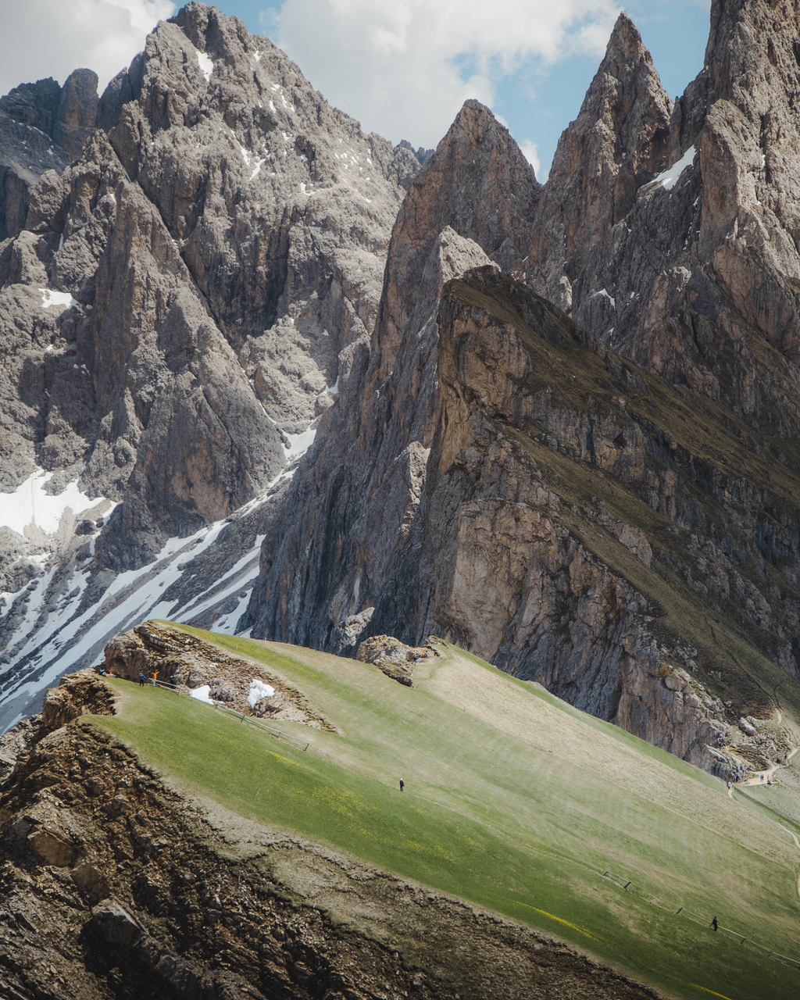
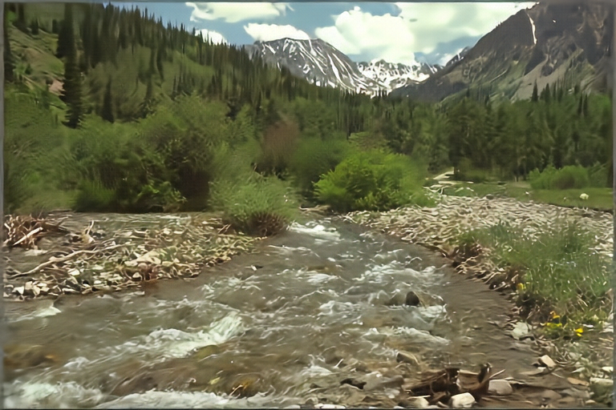

## More Visual Examples

### CLIC 2020

The images below (left) are taken from the [CLIC 2020 test set](https://www.tensorflow.org/datasets/catalog/clic), external to the training set. The right images are their corresponding reconstructions, when using MRIC ($\beta=2.56$) with  $\lambda=0.128$ (lowest quality setting).

<div align="center">
  
  
</div>

```python
CLIC 2020: 0d57 | Bits per pixel: 0.0508 (23.3 kB)
```


<div align="center">
  
  
</div>

```python
CLIC 2020: 977d | Bits per pixel: 0.1431 (23.4 kB)
```

<div align="center">
  
  
</div>

```python
CLIC 2020: 0824 | Bits per pixel: 0.1573 (25.8 kB)
```

### Kodak

The images below are taken from the [Kodak dataset](https://r0k.us/graphics/kodak/), external to the training set. Here we show different operating modes of MRIC (reimpl) with $\lambda=0.128$ (lowest quality setting), 
for $\beta=0.0$ (low distortion) and $\beta=2.56$ (high fidelity).

<div align="center">
  
  
</div>

```python
Kodak: kodim13 | Bits per pixel: 0.2448 (12 kB)
```

<div align="center">
  
  
</div>

```python
Kodak: kodim22 | Bits per pixel: 0.1226 (6.03 kB)
```